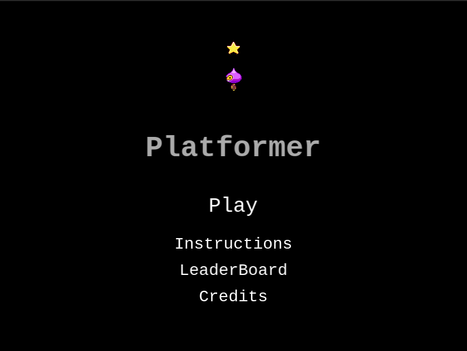
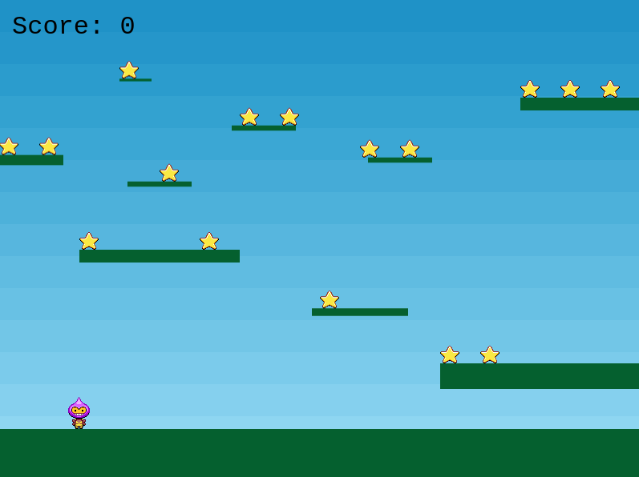
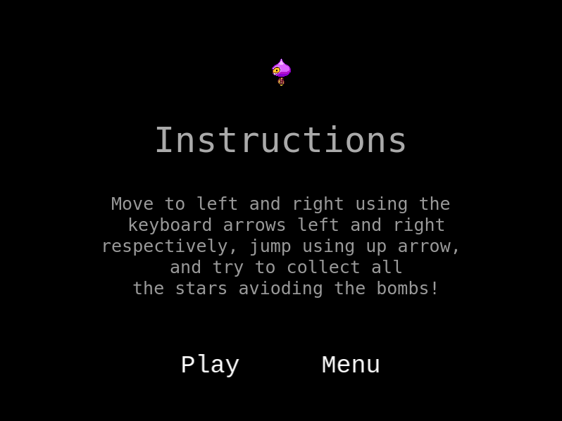
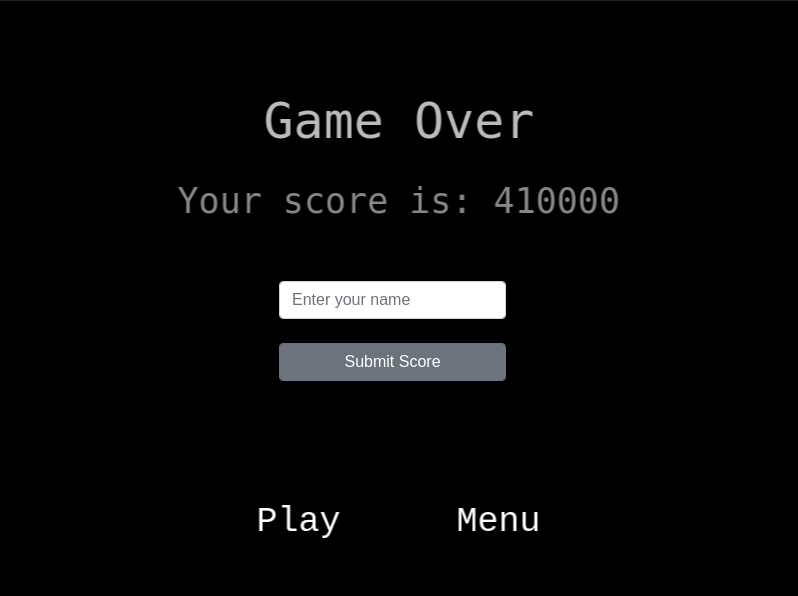
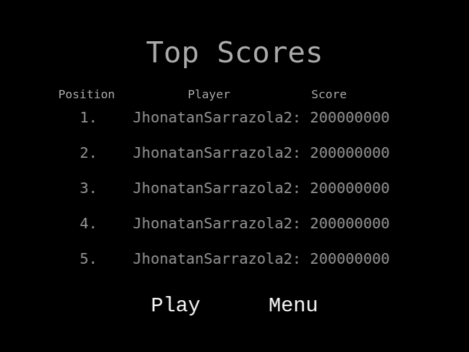

# JavaScript Platformer Game

> This is a platformer game built with Phaser, JavaScript, Webpack, and Jest technologies.

## Built With

- JavaScript
- Phaser
- Nodejs
- Jest
- Webpack

## Live Demo

[Live Demo Link](https://gracious-wozniak-48c37e.netlify.app/)

> Note: Open it using Google Chrome browser.

## How to play

To play the game you only need a keyboard and Google Chrome browser.

- Move to right using ➡️ arrow
- Move to left using ⬅️ arrow
- Jump using ⬆️ arrow

The objective of the game is to collect the stars, every time you collect 16 stars, a bomb enters the game, you have to continue collecting stars avoiding the bombs that will be appearing every 16 bombs collected, if a bomb touches you, GameOver.

## Game Design

The design of the game has been taken from Phase Documentation page, all of the assets and images were provided from Phaser:

### Player Spritesheet  

### Star  

### Bomb  

### Title Screen

### Game Screen

### Instructions Screen

### Game Over Screen

### LeaderBoard Screen

## Getting Started

To get a local copy up and running follow these simple example steps:

- Run the command `git clone https://github.com/jssarrazolaa/JS-Game.git`
- Go to the root folder in the terminal and run `npm install`
- Then you can add or delete characteristics of the game and test them in your local machine starting a local server running `npm run start`

### Prerequisites

- Nodejs
- Phaser
- Webpack
- Google Chrome

### Run tests

To run code test, use the command `npm test` in the root folder.

### Deployment

The deployment has been made in Netlify

## Authors

👤 **Jhonatan Sarrazola**

- GitHub: [@jssarrazolaa](https://github.com/jssarrazolaa)
- Twitter: [@StevenAlvarez_](https://twitter.com/StevenAlvarez_)
- LinkedIn: [Jhonatan Sarrazola](https://www.linkedin.com/in/jhonatansarrazola/)

## 🤝 Contributing

Contributions, issues, and feature requests are welcome!

Feel free to check the [issues page](https://github.com/jssarrazolaa/JS-Game/issues).

## Show your support

Give a ⭐️ if you like this project!

## Acknowledgments

- Phaser
- Microverse
- [Mupa M'mbetsa Nzaphila](https://github.com/Mupa1)

## 📝 License

This project is [MIT](lic.url) licensed.
